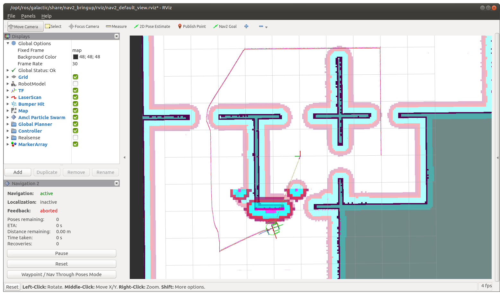

# Notes on Manning LiveCourse: [Navigation](https://liveproject.manning.com/project/859/559/navigation?)

* [Back to TOP](https://github.com/dblanding/ROS2_live_course)

# Milestone 1: Create launch files for first automatic drive
* `ros2 launch dribot_simulation gazebo_house_launch.py`
* `ros2 launch dribot_navigation navigation_launch.py`

# Milestone 2: Planners & Controllers
## Learning Resources:
* [Setting up navigation plugins](https://navigation.ros.org/setup_guides/algorithm/select_algorithm.html)
    * Has a link to [Navigation servers](https://navigation.ros.org/concepts/index.html#navigation-servers)
* [ROS2 Navigation Concepts](https://navigation.ros.org/concepts/index.html)
## Experiment with different planners / controllers / parameters
* Be sure to use `colcon build --symlink-install` to allow parameter file to be installed as a synbolic link.
* Use this [Configuration Guide](https://navigation.ros.org/configuration/index.html) when trying out different planners and controllers.
## Screenshots showing paths of differenet planners
### NavFn:

### Theta Star:

### Smac 2D Planner:

### Smac Hybrid-A* Planner:

## Experiment with different Controllers
* Two different Controllers available:
    * **DWB**
    * **Regulated Pure Pursuit**
* The yaml format dosn't provide an easy way to comment out blocks
    * It's a pain to comment out blocks for unused controllers
    * Instead, create a symbolic link to access file for desired controller
    * `ln -s <target_file> nav2_params.yaml`
* Use target file: `nav2_params_DWB.yaml` for **DWB**
* Use target file: `nav2_params_M2sol_RPP.yaml` for **Regulated Pure Pursuit**

# Milestone 3: Costmaps (global & local)
### robot_radius = 0.22 m:

### robot_radius = 0.25 m:

### inflation radius = 0.55:

### inflation radius = 0.4:

* I tried changing these parameters using `ros2 param set` but the changes didn't take effect  on the screen. I had to change the values in the yaml file and relaunch.
### Below shows the effect of revising `cost_scaling_factor` from 3.0 to 2.0. There is no discernible effect on the costmap. According to the [documentation](https://navigation.ros.org/configuration/packages/costmap-plugins/inflation.html), the cost scaling factor is the Exponential decay factor across inflation radius. I thought I might notice a difference in the distance the path planner allows around corners and obstacles, but I didn't notic any, so I decided to just leave it at 3.0.

********************************************************************************
### Here is the current directory structure at this point.
```
doug@raspi4:~$ tree /home/doug/ws/nav/src/dribot_navigation
/home/doug/ws/nav/src/dribot_navigation
├── CMakeLists.txt
├── include
│   └── dribot_navigation
├── launch
│   ├── navigation_ans_launch.py
│   └── navigation_launch.py
├── package.xml
├── params
│   ├── nav2_params_BRINGUP.yaml
│   ├── nav2_params_DWB.yaml
│   ├── nav2_params_M1sol.yaml
│   ├── nav2_params_M2sol_RPP.yaml
│   ├── nav2_params_M2sol.yaml
│   ├── nav2_params_M3sol.yaml
│   ├── nav2_params_ORIG.yaml
│   ├── nav2_params_RPP.yaml
│   └── nav2_params.yaml -> nav2_params_DWB.yaml
└── src
```
## Milestone 4: Waypoint Navigation
* Create Package `dribot_wp_follower` 

`ros2 pkg create --build-type ament_python --node-name wp_follower dribot_wp_follower --dependencies nav2_msgs`

* Complete Steps 1, 2, 3 & 4
* Downladed partial solution
* Here is the current directory structure at this point.
```
doug@raspi4:~$ tree /home/doug/ws/nav/src/dribot_wp_follower
/home/doug/ws/nav/src/dribot_wp_follower
├── dribot_wp_follower
│   ├── __init__.py
│   └── wp_follower.py
├── launch
│   └── follow_waypoints_launch.py
├── package.xml
├── res
│   ├── waypoints.yaml
│   └── yaml_foo.py
├── resource
│   └── dribot_wp_follower
├── setup.cfg
├── setup.py
└── test
    ├── test_copyright.py
    ├── test_flake8.py
    └── test_pep257.py
```
* Did tutorial [Using parameters in a class](https://docs.ros.org/en/galactic/Tutorials/Beginner-Client-Libraries/Using-Parameters-In-A-Class-Python.html), created package in workspace `~/ws/dev/`.
* To prepare for Step 5, go through [ROS2 actions tutorial](https://docs.ros.org/en/galactic/Tutorials/Actions/Writing-a-Py-Action-Server-Client.html), in which an action server is created, and an action client is written.
    * First, do the prerequisite [Creating an action](https://docs.ros.org/en/galactic/Tutorials/Intermediate/Creating-an-Action.html) tutorial, which creates package `action_tutorials_interfaces` in workspace `~/ws/action_ws`.
    * I also found a [Medium Article](https://medium.com/schmiedeone/getting-started-with-ros2-part-3-231a1ac3b1ee) that goes through the same process, but offers the insights and perspective of another author.
    * An [article about ros2 actions](http://design.ros2.org/articles/actions.html) provides an overview of ROS2 actions, including a perspective on the way they have been implemented differently than in ROS1.
* In order to complete step 5, needed to install 'tf_transformations'
    * `sudo apt install ros-galactic-tf-transformations`
* Upon completion of Step 5, launch simulation and test waypoint follower:
    * `ros2 launch dribot_simulation gazebo_house_launch.py`
    * `ros2 launch dribot_navigation navigation_launch.py`
    * `ros2 launch dribot_wp_follower follow_waypoints_launch.py`
* Unfortunately, the follow_waypoints demonstration didn't go to completion on my Raspi4. The screenshot below shows the concatenated paths were found, but the controller aborted (as it often does) on its way to the first waypoint.

********************************************************************************
## Future work(?)

> The basics covered in this project should be a good foundation for your navigation needs. If you want to explore Nav2 further, you can implement
* [Keepout Zones](https://navigation.ros.org/tutorials/docs/navigation2_with_keepout_filter.html)
* [Speed Limits](https://navigation.ros.org/tutorials/docs/navigation2_with_speed_filter.html)
* [Behavior Trees](https://navigation.ros.org/behavior_trees/index.html)

