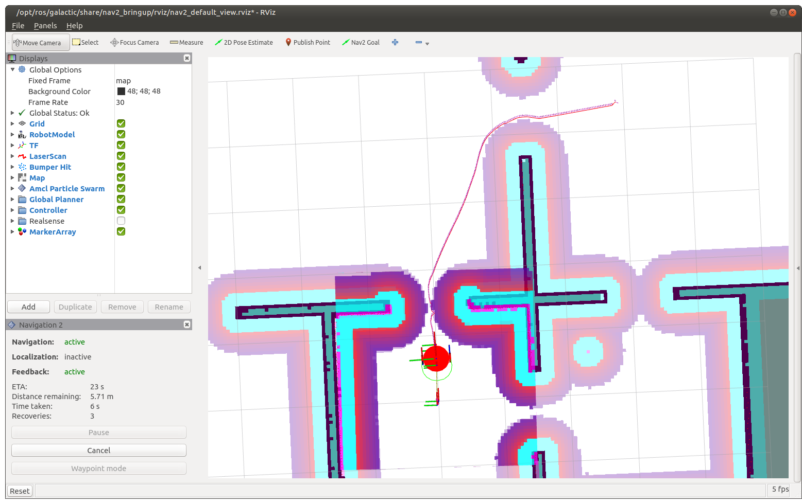
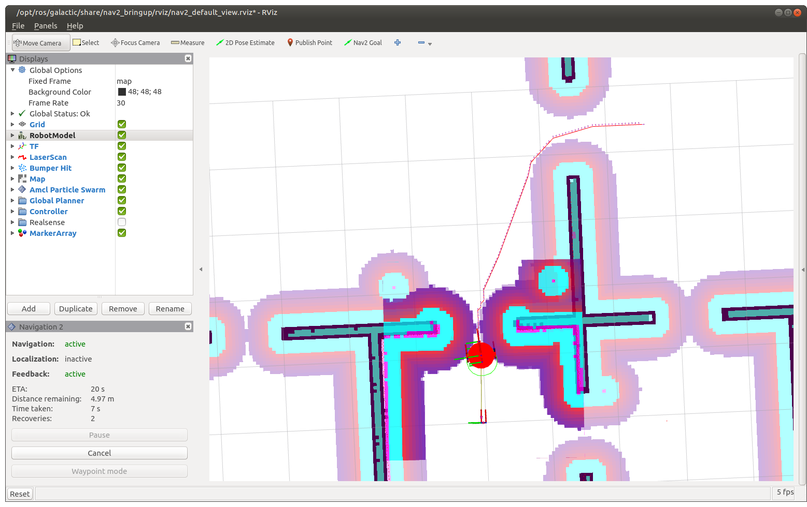
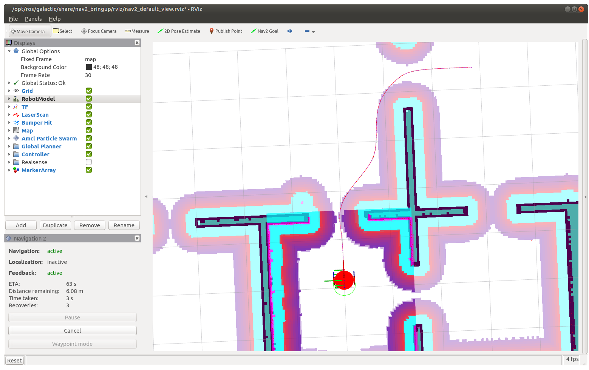
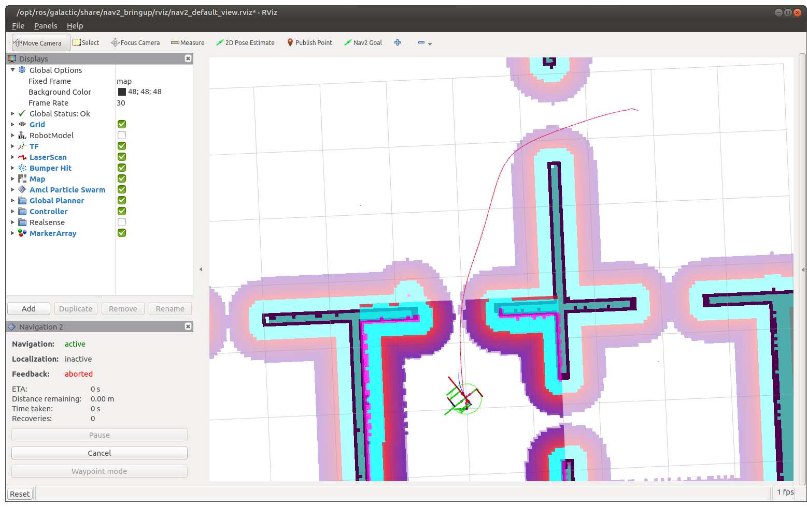
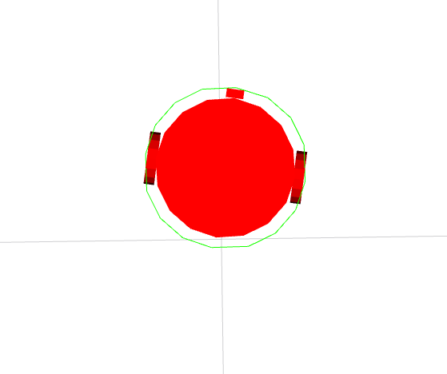
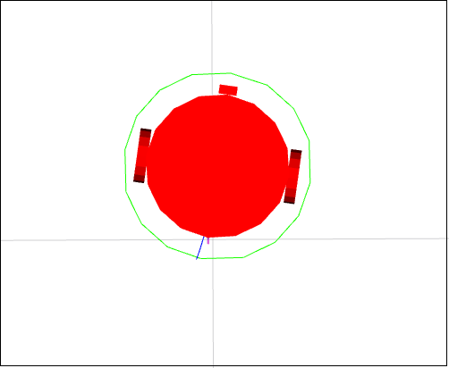
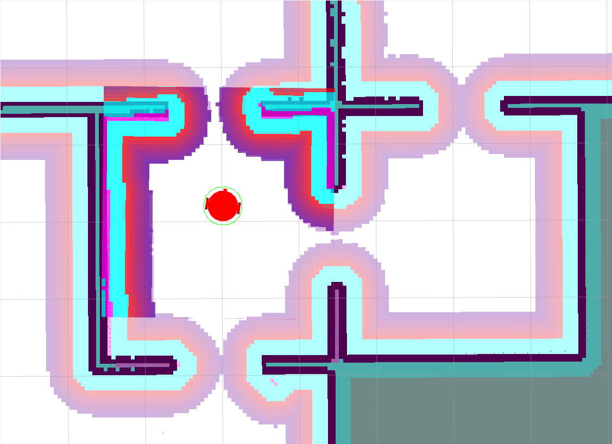
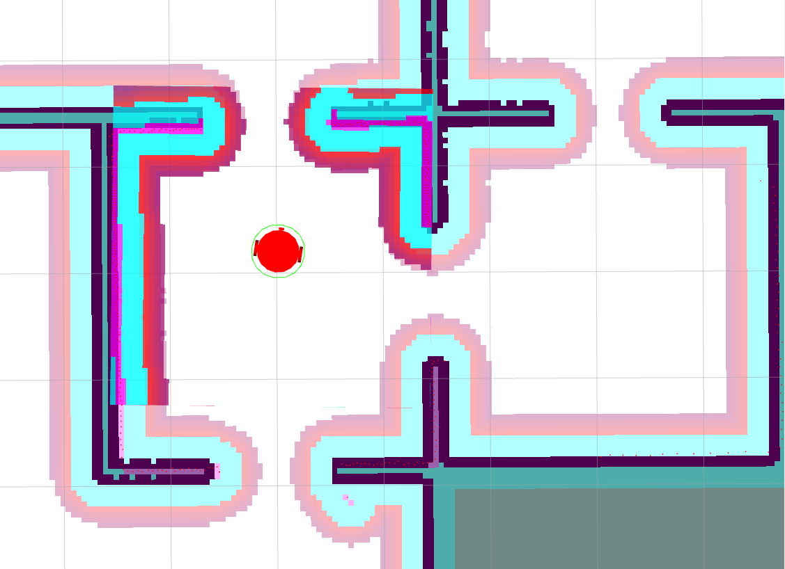
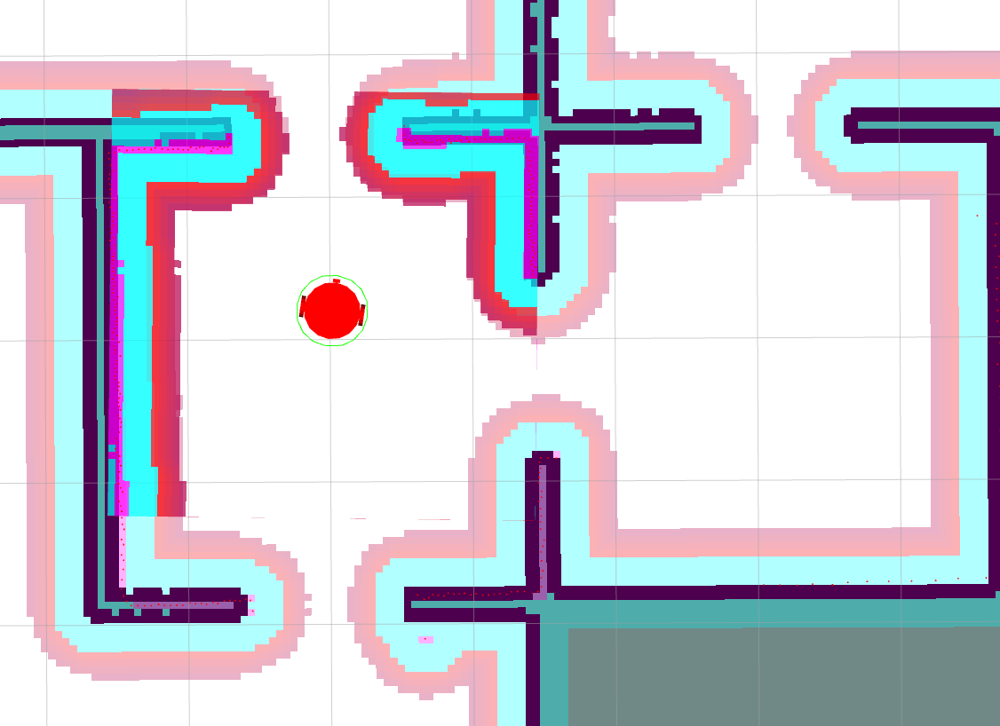

# Notes on Manning LiveCourse: [Navigation](https://liveproject.manning.com/project/859/559/navigation?)

* [Back to TOP](https://github.com/dblanding/ROS2_live_course)

# Milestone 1: Create launch files for first automatic drive
* `ros2 launch dribot_simulation gazebo_house_launch.py`
* `ros2 launch dribot_navigation navigation_launch.py`

# Milestone 2: Planners & Controllers
## Learning Resources:
* [Setting up navigation plugins](https://navigation.ros.org/setup_guides/algorithm/select_algorithm.html)
    * Has a link to [Navigation servers](https://navigation.ros.org/concepts/index.html#navigation-servers)
* [ROS2 Navigation Concepts](https://navigation.ros.org/concepts/index.html)
## Experiment with different planners / controllers / parameters
* Be sure to use `colcon build --symlink-install` to allow parameter file to be installed as a synbolic link.
* Use this [Configuration Guide](https://navigation.ros.org/configuration/index.html) when trying out different planners and controllers.
## Screenshots showing paths of differenet planners
### NavFn:

### Theta Star:

### Smac 2D Planner:

### Smac Hybrid-A* Planner:

## Experiment with different Controllers
* Two different Controllers available:
    * **DWB**
    * **Regulated Pure Pursuit**
* The yaml format dosn't provide an easy way to comment out blocks
    * It's a pain to comment out blocks for unused controllers
    * Instead, create a symbolic link to access file for desired controller
    * `ln -s <target_file> nav2_params.yaml`
* Use target file: `nav2_params_DWB.yaml` for **DWB**
* Use target file: `nav2_params_M2sol_RPP.yaml` for **Regulated Pure Pursuit**

# Milestone 3: Costmaps (global & local)
### robot_radius = 0.22 m:

### robot_radius = 0.25 m:

### inflation radius = 0.55:

### inflation radius = 0.4:

* I tried changing these parameters using `ros2 param set` but the changes didn't take effect  on the screen. I had to change the values in the yaml file and relaunch.
### Below shows the effect of revising `cost_scaling_factor` from 3.0 to 2.0. There is no discernible effect on the costmap. According to the [documentation](https://navigation.ros.org/configuration/packages/costmap-plugins/inflation.html), the cost scaling factor is the Exponential decay factor across inflation radius. I thought I might notice a difference in the distance the path planner allows around corners and obstacles, but I didn't notic any, so I decided to just leave it at 3.0.

