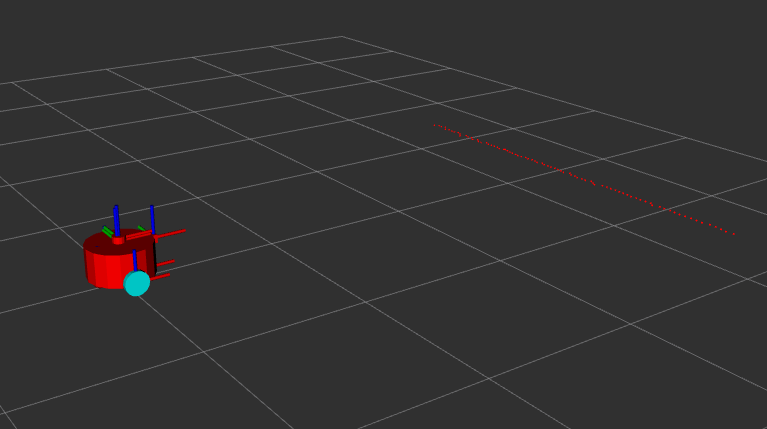
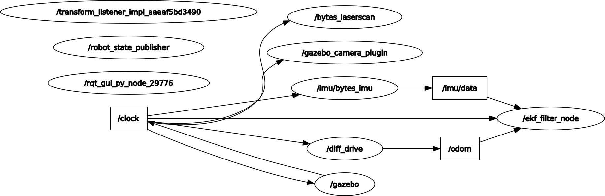
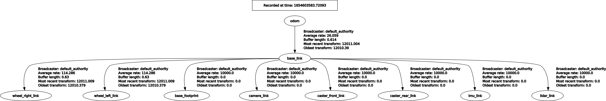
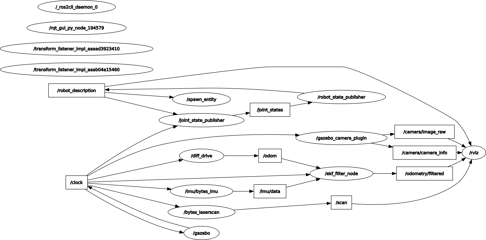
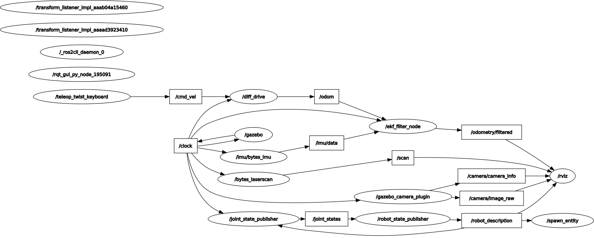

# Notes on Manning LiveCourse [Sensors & Sensor Fusion](https://liveproject.manning.com/project/857/557/sensors-and-sensor-fusion?)

* [Back to TOP](https://github.com/dblanding/ROS2_live_course)

#### Project resources
* [The Quick Python Book, Third Edition](https://livebook.manning.com/book/the-quick-python-book-third-edition/about-this-book/) by Naomi Ceder
* [Robotics for Software Engineers](https://livebook.manning.com/book/robotics-for-software-engineers/welcome/v-2/) by Andreas Bihlmaier
* [How a Kalman filter works, in pictures](https://www.bzarg.com/p/how-a-kalman-filter-works-in-pictures/)
* [Robot Localization Package](http://docs.ros.org/en/noetic/api/robot_localization/html/index.html)
* [Kalman and Bayesian Filters in Python](https://github.com/rlabbe/Kalman-and-Bayesian-Filters-in-Python) – If you want to build practical experience developing your own filters, then this interactive book might be of interest to you. However, knowing Kalman filters on such a deep level is not required for this project.
* Here is a comprehensive guide to help you [configure sensors using gazebo_ros plugins](https://medium.com/@bytesrobotics/a-review-of-the-ros2-urdf-gazebo-sensor-91e947c633d7) and get your own robot up and running.
## This project is in workspace: `~/ws/sensors`:
```
cd ~/ws/sensors
source install/setup.bash
```
## Milestone 1: Integrate a Camera
* Add camera.xacro to dribot
* Launch Gazebo & Rviz, spawn dribot with camera.
    * `ros2 launch dribot_perception camera_launch.py`
* Add a brick wall to Gazebo scene and see camera view in rviz


## Milestone 2: Add Lidar
* Add lidar.xacro with lidar plugin) to dribot.
    * `ros2 launch dribot_simulation gazebo_launch.py`
* launch rviz
    * `ros2 run rviz2 rviz2`
* Add a brick wall in gazebo and see lidar line in rviz
* One sticky spot I encountered:
    * I had to change the name 'head' to 'lidar_link' in the plugin code I copied into the xacro file.



## Milestone 3: Add IMU
* This was pretty straightforward. Just copied the plugin into a new xacro file.

## Milestone 4: Find the issue in a setup having the IMU and Lidar too close together.
* Use plotjuggler to examine time series data in a bag file. Pretty Cool!

## Milestone 5: EKF
* I had a couple of problems with this milestone:
    1. I naively renamed the ekf_filter_node to ekf_node, not realizing that the parameter file ekf.yaml referred to the name ekf_filter_node. As a result, the parameters didn't get loaded.
    2. Another issue that plagued me was a flood of timing warnings coming from gazebo. Discovered that not all the nodes were using sim_time.
        * Use `ros2 param list` to get a list of all params in all nodes
        * Use `ros2 param get <node_name> use_sim_time` to get the boolean value for each node.
        * Turns out that there were three nodes with value= `false`:
            * /robot_state_publisher
            * /robot_joint_publisher
            * /ekf_filter_node
                * Just needed to fix this by adding a parameter to ekf.yaml file

### Once I got these 2 problems sorted out:
I was able to run a series of launch commands:
1. `ros2 launch dribot_simulation gazebo_launch.py`
2. `ros2 launch dribot_perception dribot_ekf_launch.py`
    * Examine the system graph using `ros2 run rqt_graph rqt_graph`. This shows /clock being published by gazebo and all nodes using it.


    * `ros2 run rqt_tf_tree rqt_tf_tree` shows **odom frame** is now the parent of base_link:


3. Next, start RViz
    * `ros2 run rviz2 rviz2`
    * Click to enable camera view
    * `ros2 run rqt_graph rqt_graph`



4. Launch teleop to drive the robot around using:
    * `ros2 run teleop_twist_keyboard teleop_twist_keyboard`
    * `ros2 run rqt_graph rqt_graph`



## PS: I went back to see if I could reconstruct the flood of warning errors encountered above:
* I ran `git diff` to find the 2 edits I made that "fixed" the problem
    1. Name of ekf node didn't match name at the top of the ekf.yaml file
    2. The parameter use_sim_time was not set to True in ekf.yaml
* I put these two edits back to their earlier configuration, and the ran `colcon build`, but the flood of warning errors could not be induced.
    * I concluded that the process of building generates new files, but doesn't remove any old files, so the only way I would get the errors to come back would be to scrap all the existing folders (except src/) and build afresh.
        * Decided to try this in a new workspace named sensors2.
        * Results were inconclusive. I wasn't able to get the flood of warning messages I had before.
        * Possibly because a recent s/w update revised something in one of the ros2 packages??

## Examine author's solution src/ and compare against my src/:
1. Set up SIDE by SIDE comparison between my /src tree and author solution /src tree
    * use $ `tree /home/doug/ws/sensors/src` to geberate tree:
```
/home/doug/ws/sensors/src
├── dribot_description
│   ├── CMakeLists.txt
│   ├── launch
│   │   ├── load_description_launch.py
│   │   └── rviz_launch.py
│   ├── package.xml
│   └── urdf
│       ├── camera.xacro
│       ├── caster.xacro
│       ├── dribot_description.xacro
│       ├── imu.xacro
│       ├── lidar.xacro
│       ├── macros.xacro
│       └── wheel.xacro
├── dribot_perception
│   ├── dribot_perception
│   │   └── __init__.py
│   ├── launch
│   │   ├── camera_launch.py
│   │   └── dribot_ekf_launch.py
│   ├── package.xml
│   ├── params
│   │   └── ekf.yaml
│   ├── resource
│   │   └── dribot_perception
│   ├── setup.cfg
│   ├── setup.py
│   └── test
│       ├── test_copyright.py
│       ├── test_flake8.py
│       └── test_pep257.py
├── dribot_simulation
│   ├── CMakeLists.txt
│   ├── launch
│   │   └── gazebo_launch.py
│   └── package.xml
├── dribot_teleop
│   ├── dribot_teleop
│   │   ├── __init__.py
│   │   └── vel_mux.py
│   ├── package.xml
│   ├── resource
│   │   └── dribot_teleop
│   ├── setup.cfg
│   ├── setup.py
│   └── test
│       ├── test_copyright.py
│       ├── test_flake8.py
│       └── test_pep257.py
├── images
│   └── rviz.png
└── README.md
```

### Note any significant differences:

#### In dribot_description.xacro:
    In diff_drive plugin:
        * I  had <robot_base_frame> base_link </robot_base_frame>
        * Author's solution: <robot_base_frame> base_footprint </robot_base_frame>

#### In ekf.yaml:
    In odom0_config:
        * I had:
```
        odom0_config: [true, true, false, #x, y, z
                       false, false, true, #roll, pitch, yaw
                       false, false, false, #vx, vy, vz
                       false, false, false,  #vroll, vpitch, vyaw
                       false, false, false] #ax, ay, az
```

        * author's solution had:
```
        odom0_config: [false, false, false, #x, y, z
                       false, false, false, #roll, pitch, yaw
                       true, true, true, #vx, vy, vz
                       false, false, true,  #vroll, vpitch, vyaw
                       false, false, false] #ax, ay, az
```
#### In dribot_simulation -> gazebo_launch.py:
    I made no changes, whereas the author added 2 lines:
        * first set_sim_time true
        * and at the end launched ekf
```
    return launch.LaunchDescription([
        launch_ros.actions.SetParameter(name='use_sim_time', value=True),
        gazebo,
        spawn_entity,
        robot_description,
        ekf
```
