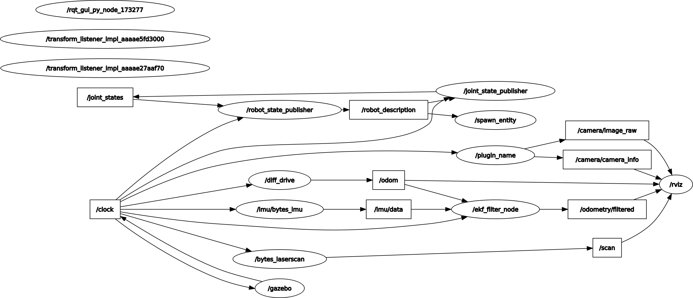

# Notes on Manning LiveCourse [Sensors & Sensor Fusion](https://liveproject.manning.com/project/857/557/sensors-and-sensor-fusion?)

* [Back to TOP](https://github.com/dblanding/ROS2_live_course)

#### Project resources
* [The Quick Python Book, Third Edition](https://livebook.manning.com/book/the-quick-python-book-third-edition/about-this-book/) by Naomi Ceder
* [Robotics for Software Engineers](https://livebook.manning.com/book/robotics-for-software-engineers/welcome/v-2/) by Andreas Bihlmaier
* [How a Kalman filter works, in pictures](https://www.bzarg.com/p/how-a-kalman-filter-works-in-pictures/)
* [Robot Localization Package](http://docs.ros.org/en/noetic/api/robot_localization/html/index.html)
* [Kalman and Bayesian Filters in Python](https://github.com/rlabbe/Kalman-and-Bayesian-Filters-in-Python) – If you want to build practical experience developing your own filters, then this interactive book might be of interest to you. However, knowing Kalman filters on such a deep level is not required for this project.
* Here is a comprehensive guide to help you [configure sensors using gazebo_ros plugins](https://medium.com/@bytesrobotics/a-review-of-the-ros2-urdf-gazebo-sensor-91e947c633d7) and get your own robot up and running.
## This project is in workspace: `~/ws/sensors`:
```
cd ~/ws/sensors
source install/setup.bash
```
## Milestone 1: Integrate a Camera
* Add camera.xacro to dribot
* Launch Gazebo & Rviz, spawn dribot with camera.
    * `ros2 launch dribot_perception camera_launch.py`
* Add a brick wall to Gazebo scene and see camera view in rviz


## Milestone 2: Add Lidar
* Add lidar.xacro with lidar plugin) to dribot.
    * `ros2 launch dribot_simulation gazebo_launch.py`
* launch rviz
    * `ros2 run rviz2 rviz2`
* Add a brick wall in gazebo and see lidar line in rviz
* One sticky spot I encountered:
    * I had to change the name 'head' to 'lidar_link' in the plugin code I copied into the xacro file.


## Milestone 3: Add IMU
* This was pretty straightforward. Just copied the plugin into a new xacro file.

## Milestone 4: Find the issue in a setup having the IMU and Lidar too close together.
* Use plotjuggler to examine time series data in a bag file. Pretty Cool!

## Milestone 5: EKF
* I had a couple of problems with this milestone:
    1. I naiively renamed the ekf_filter_node to ekf_node, not realizing that the parameter file ekf.yaml referred to the name ekf_filter_node. As a result, the parameters didn't get set.
    2. Another issue that plagued me was getting a flood of timing warnings. The problem was that not all the nodes were using sim_time.
        * Use `ros2 param list` to get a list of all params in all nodes
        * Use `ros2 param get <node_name> use_sim_time` to get the boolean value for each node.
        * Turns out that there were three nodes with value= `false`:
            * /robot_state_publisher
            * /robot_joint_publisher
            * /ekf_filter_node

### Once I got these problems sorted out, I was able to launch with 2 commands:
1. `ros2 launch dribot_simulation gazebo_launch.py`
    * I set the use_sim_time parameters for 2 nodes "on the fly":
        * `ros2 param set /robot_state_publisher true`
        * `ros2 param set /robot_joint_publisher true`
2. * `ros2 launch dribot_perception dribot_ekf_launch.py`
    * (The use_sim_time parameter was set in file ekf.yaml)
### I was able to drive the robot around with:
* `ros2 run teleop_twist_keyboard teleop_twist_keyboard`
### I was then able to graph the system

* `ros2 run rqt_tf_tree rqt_tf_tree`


* `ros2 run rqt_graph rqt_graph`



