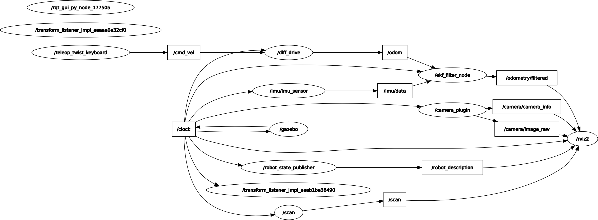
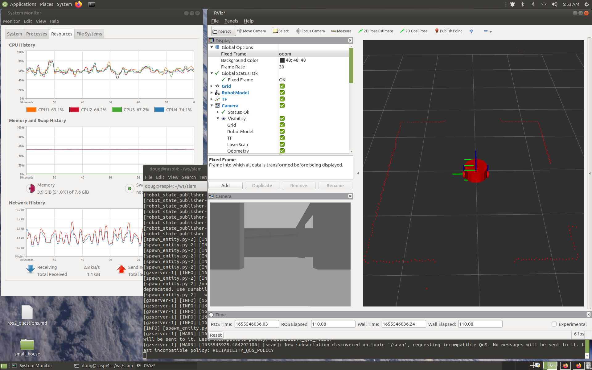
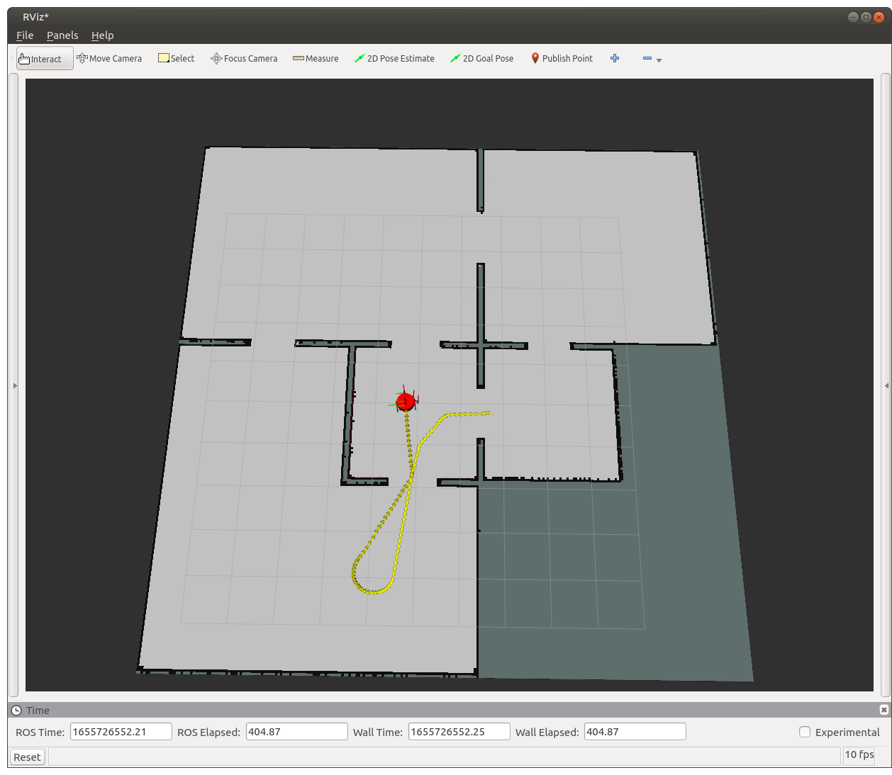

# Notes on Manning LiveCourse [Simultaneous Localization & Mapping](https://liveproject.manning.com/module/858_1_1/simultaneous-localization-and-mapping/introduction/animated-intro?)

* [Back to TOP](https://github.com/dblanding/ROS2_live_course)

## Trouble launching Gazebo
1. I Started the project in the usual way:
    * Create a Manning repository for liveProject
    * Create a workspace `~/ws/slam`
    * `cd ~/ws/slam`
    * 'git clone <url_of_newly_created_repo> src`
2. Add a aws-robomaker-small-house-world package to my project.
    * I chose to download the partial solution, as it contains everything done so far in addition to the package.
3. To make sure wverything is working as it did in the previous project, I tried to run `ros2 launch dribot_simulation gazebo_launch.py` but it produced errors in the terminal window.

The output started out looking normal:
```
doug@raspi4:~/ws/slam$ ros2 launch dribot_simulation gazebo_launch.py
[INFO] [launch]: All log files can be found below /home/doug/.ros/log/2022-06-12-03-54-56-697447-raspi4-103829
[INFO] [launch]: Default logging verbosity is set to INFO
[INFO] [gzserver-1]: process started with pid [103835]
[INFO] [gzclient   -2]: process started with pid [103837]
[INFO] [spawn_entity.py-3]: process started with pid [103840]
[INFO] [robot_state_publisher-4]: process started with pid [103843]
[INFO] [ekf_node-5]: process started with pid [103845]
[robot_state_publisher-4] The root link base_link has an inertia specified in the URDF, but KDL does not support a root link with an inertia.  As a workaround, you can add an extra dummy link to your URDF.
[robot_state_publisher-4] Link base_footprint had 0 children
[robot_state_publisher-4] Link camera_link had 0 children
[robot_state_publisher-4] Link caster_front_link had 0 children
[robot_state_publisher-4] Link caster_rear_link had 0 children
[robot_state_publisher-4] Link imu_link had 0 children
[robot_state_publisher-4] Link lidar_link had 0 children
[robot_state_publisher-4] Link wheel_left_link had 0 children
[robot_state_publisher-4] Link wheel_right_link had 0 children
[robot_state_publisher-4] [INFO] [1655020500.636536764] [robot_state_publisher]: got segment base_footprint
[robot_state_publisher-4] [INFO] [1655020500.636917648] [robot_state_publisher]: got segment base_link
[robot_state_publisher-4] [INFO] [1655020500.637015480] [robot_state_publisher]: got segment camera_link
[robot_state_publisher-4] [INFO] [1655020500.637064016] [robot_state_publisher]: got segment caster_front_link
[robot_state_publisher-4] [INFO] [1655020500.637102256] [robot_state_publisher]: got segment caster_rear_link
[robot_state_publisher-4] [INFO] [1655020500.637137071] [robot_state_publisher]: got segment imu_link
[robot_state_publisher-4] [INFO] [1655020500.637171885] [robot_state_publisher]: got segment lidar_link
[robot_state_publisher-4] [INFO] [1655020500.637206792] [robot_state_publisher]: got segment wheel_left_link
[robot_state_publisher-4] [INFO] [1655020500.637241810] [robot_state_publisher]: got segment wheel_right_link
[spawn_entity.py-3] [INFO] [1655020502.606344951] [spawn_entity]: Spawn Entity started
[spawn_entity.py-3] [INFO] [1655020502.608795752] [spawn_entity]: Loading entity published on topic robot_description
[spawn_entity.py-3] [INFO] [1655020502.624419450] [spawn_entity]: Waiting for entity xml on robot_description
[spawn_entity.py-3] [INFO] [1655020502.641727106] [spawn_entity]: Waiting for service /spawn_entity, timeout = 5
[spawn_entity.py-3] [INFO] [1655020502.645068099] [spawn_entity]: Waiting for service /spawn_entity
```
The next part is where the errors occurred. What should have been **Normal**:
```
[spawn_entity.py-3] [INFO] [1655020505.686464514] [spawn_entity]: Calling service /spawn_entity
[gzserver-1] [INFO] [1655020507.743615326] [gazebo_camera_plugin]: Publishing camera info to [/camera/camera_info]
[spawn_entity.py-3] [INFO] [1655020508.831758444] [spawn_entity]: Spawn status: SpawnEntity: Successfully spawned entity [my_bot]
[spawn_entity.py-3] /opt/ros/galactic/lib/python3.8/site-packages/rclpy/qos.py:307: UserWarning: DurabilityPolicy.RMW_QOS_POLICY_DURABILITY_TRANSIENT_LOCAL is deprecated. Use DurabilityPolicy.TRANSIENT_LOCAL instead.
[spawn_entity.py-3]   warnings.warn(
[gzserver-1] [INFO] [1655020509.232758568] [diff_drive]: Wheel pair 1 separation set to [0.450000m]
[gzserver-1] [INFO] [1655020509.235289238] [diff_drive]: Wheel pair 1 diameter set to [0.150000m]
[gzserver-1] [INFO] [1655020509.244744426] [diff_drive]: Subscribed to [/cmd_vel]
[gzserver-1] [INFO] [1655020509.260443345] [diff_drive]: Advertise odometry on [/odom]
[gzserver-1] [INFO] [1655020509.289251848] [diff_drive]: Publishing wheel transforms between [base_link], [wheel_left_joint] and [wheel_right_joint]
[INFO] [spawn_entity.py-3]: process has finished cleanly [pid 103840]
```
Looked instead like **this**:
```
[spawn_entity.py-3] [ERROR] [1654937060.957289831] [spawn_entity]: Service /spawn_entity unavailable. Was Gazebo started with GazeboRosFactory?
[spawn_entity.py-3] [ERROR] [1654937060.961765643] [spawn_entity]: Spawn service failed. Exiting.
[spawn_entity.py-3] /opt/ros/galactic/lib/python3.8/site-packages/rclpy/qos.py:307: UserWarning: DurabilityPolicy.RMW_QOS_POLICY_DURABILITY_TRANSIENT_LOCAL is deprecated. Use DurabilityPolicy.TRANSIENT_LOCAL instead.
[spawn_entity.py-3] warnings.warn(
[ERROR] [spawn_entity.py-3]: process has died [pid 15891, exit code 1, cmd ‘/opt/ros/galactic/lib/gazebo_ros/spawn_entity.py -topic robot_description -entity my_bot --ros-args’].
```
1. I went back to the previous project workspace (sensors) and checked that I could still launch gazebo OK and I could.
2. I copied the launch file from the new (slam) ws back to the sensors ws (renamed gazebo1_launch.py) and gazebo launched OK.
3. I copied the launch file from the sensors ws into the new slam ws (renamed gazebo0_launch.py) and it did **not** launch OK.
4. I went to the [aws-robomaker-small-house-world website](https://github.com/aws-robotics/aws-robomaker-small-house-world/tree/ros2) and followed the instructions for how to build and launch gazebo with the small house world. This **did work OK**. In the README it was [explained how to build and launch](https://github.com/aws-robotics/aws-robomaker-small-house-world/tree/ros2#ros-launch-with-gazebo-viewer-without-a-robot) the small house world in gazebo.
```
# build for ROS
source /opt/ros/galactic/setup.bash
source /usr/share/gazebo/setup.sh
rosdep install --from-paths . --ignore-src -r -y
colcon build

# run in ROS
source install/setup.sh
ros2 launch aws_robomaker_small_house_world small_house.launch.py gui:=true
```
### In summary:
* I added the two "source" lines to my `~/bashrc` file.
* As a standard practice, before doing `colcon build`, I will make it a habit to run `rosdep install --from-paths . --ignore-src -r -y`
* For the 3 launch files in dribot_simulation:
    * gazebo_launch.py launches OK.
    * gazebo0_launch.py launches OK.
    * gazebo_house_launch.py shows the house OK but fails to launch the robot.
* I later learned that the RasPi4 is only **just barely** able to launch this Gazebo small_house world. It works if I try to launch **immediately after rebooting** the Pi (the CPU usage stays just below 100%). But if the Pi hasn't been freshly rebooted, the CPU usage pegs at 100% and the launch fails.
* As a workaround, I will make my own "small house" using Gazebo Building Editor.
* Launch my dribot in gazebo using `ros2 launch dribot_simulation gazebo_launch.py`
* Followed this [tutorial](https://classic.gazebosim.org/tutorials?cat=build_world&tut=building_editor#Edityourbuilding) which shows how to construct a house from a floorplan.

### Conclusion of "Trouble launching Gazebo" problem
* The aws_robomaker_small_house was so huge that it swamped my puny RasPi4
* I made my own simple_house world instead
    * The house world is in its own package: `simple_house`
        * I had to modify setup.py in the new package to find the world file
    * This imposes a far lighter load on my RasPi4
* I found an excellent medium article [Creating a Gazebo Simulation with ROS2 for your own robot](https://medium.com/creating-a-gazebo-simulation-with-ros2-for-your/introduction-8daf6efa12f4) that was very helpful.
* Also found another [article](https://www.theconstructsim.com/exploring-ros2-with-wheeled-robot-1-launch-ros2-simulation/) that was helpful in writing the launch file
* A single launch file `ros2 launch dribot_simulation gazebo_house_launch.py` now launches everything:
    * Sets parameter 'use_sim_time': true for all
    * Gazebo
        * With my simple house 'world'
        * Optionally in "headless" mode
    * spawn entity: robot
    * robot_description node
    * optionally starts Rviz `ros2 run rviz2 rviz2` showing everything working together
        * laser
        * camera
        * diff_drive responds to /cmd_vel
* However, node graph is slightly differernt than the one at the end of the previous project.
    * note difference along the path from /clock to /robot_state_publisher to /robot_description to /rviz


* Nevertheless, everything seems to work fine:



## Online learning resources: Learning about SLAM
* [Intro to SLAM](https://www.youtube.com/watch?v=0I30M6yTklo) (Cyrill Stachniss)
* On the use of SLAM Toolbox (Steve Macenski at ROSCon 2019)
    * [Video](https://vimeo.com/378682207)
    * [Slides](https://roscon.ros.org/2019/talks/roscon2019_slamtoolbox.pdf)
    * [Github repo](https://github.com/SteveMacenski/slam_toolbox)
* [Understanding SLAM Using Pose Graph Optimization](https://www.youtube.com/watch?v=saVZtgPyyJQ) Matlab Tech talk by Brian Douglas
* Mathworks [Implement Simultaneous Localization And Mapping (SLAM) with Lidar Scans](https://www.mathworks.com/help/nav/ug/implement-simultaneous-localization-and-mapping-with-lidar-scans.html) Demonstrates how to implement the Simultaneous Localization And Mapping (SLAM) algorithm on a collected series of lidar scans using pose graph optimization

## Milestone 1
### Step 6: Launch everything
* `ros2 launch dribot_simulation gazebo_house_launch.py`
* `ros2 launch dribot_slam slam_toolbox_mapping_launch.py`
* `ros2 run teleop_twist_keyboard teleop_twist_keyboard`
* `ros2 run rviz2 rviz2`
* Set world frame to /map and drive robot around until map is complete
* Add wheel odometry and EKF odometry topics. Ensure you preserve the measurements over long periods of time. Do you see the difference between both odom topics after mapping the whole space? Feel free to note the answer; we will ask about it in the final quiz.

> **Author insight**: Before you move on to the next step, to create a map usable for localization we will want to serialize the map. Saving the map is different in slam_toolbox, so when you go through the documentation please pay close attention to that. We will cover this topic more in the Author Insights section below.

### Step 7: Serialize & Save map
* `ros2 service call /slam_toolbox/serialize_map slam_toolbox/srv/SerializePoseGraph "filename: '/home/doug/ws/slam/src/dribot_slam/res/house_map'"`
* Save map in .pgm format (see notes below)

* Tab completion returns this advice:
```
doug@raspi4:~$ ros2 service call /slam_toolbox/save_map slam_toolbox/srv/SaveMap 
name:\^J\ \ data:\ \'\'\  -r                        --rate
```

* The only way I can get this to work is to copy/paste from the "hint" for step 7 (but with my path to workspace filled in):

```
ros2 service call /slam_toolbox/save_map slam_toolbox/srv/SaveMap "name:
  data: '/home/doug/ws/slam/src/dribot_slam/res/house_map'"
```
When asked how "tab completion" worked on his machine, Mat said:
> Mat Sadowski: It actually should be fine. If you now press ‘n’ followed by tab it should autocomplete to:
```
ros2 service call /slam_toolbox/save_map slam_toolbox/srv/SaveMap "name:
  data: ''"
```
> Filling in the data field should make the service work.

## Revised house world to give dribot some driving loops.
* This allows me to see loop closure during SLAM mapping.


